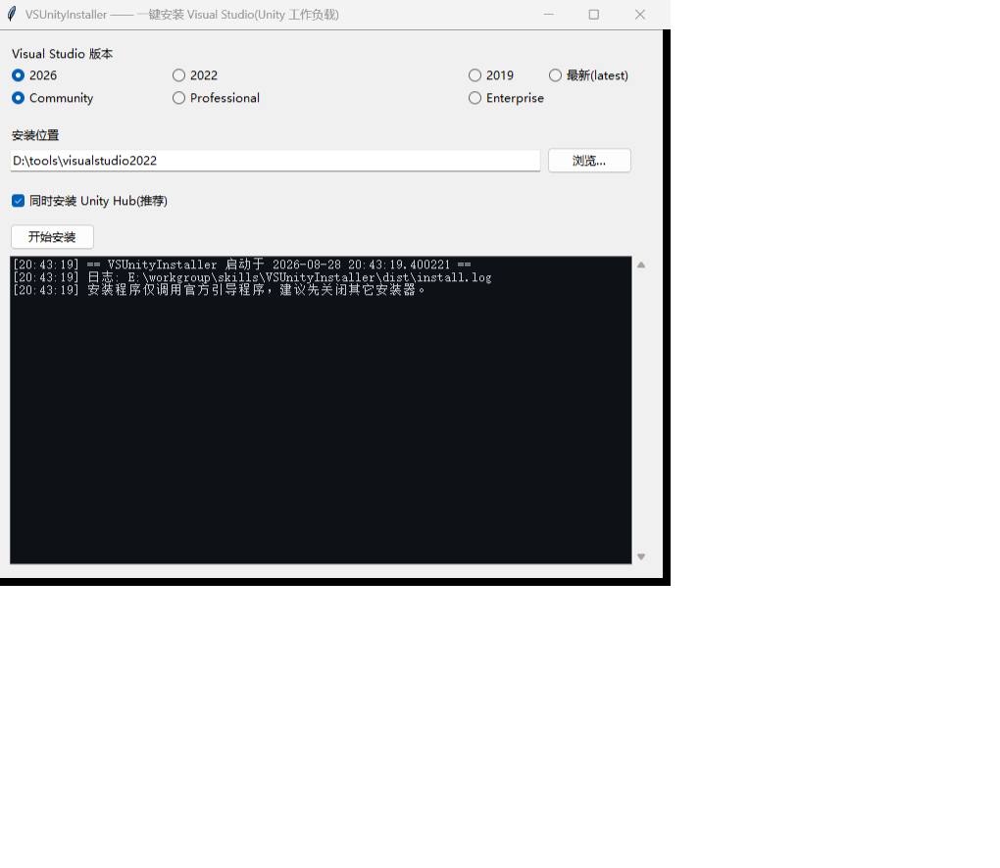

# VSUnityInstaller

> 一键安装 Visual Studio（带「使用 Unity 的游戏开发」工作负载），**可选年份 / 版别 / 安装位置**的桌面小工具。装完即可在 Unity 里直接写 C# 脚本、断点调试。
>
> **[English](README.en.md) | 中文**

   [](https://github.com/ZhaoYuanxin66/VSUnityInstaller/releases)

---

## 这是干什么的

Visual Studio 要用于 Unity 开发，必须在安装时勾选「使用 Unity 的游戏开发」工作负载，否则没有 `VS Tools for Unity`，就没法在 VS 里写脚本、打断点调试。

本工具把这件事封装成**点几下**：选年份 → 选版别 → 填安装位置 → 点安装。它自动下载微软官方引导程序并静默安装，装完自动做三项核验并给出结果报告。

## 界面预览



## 功能特性

- 🎯 **可选年份**：2019 / 2022 / 2026 / **最新(latest)**，覆盖主流与常青版本
- 🎓 **可选版别**：Community（免费）/ Professional / Enterprise
- 📁 **自定义安装位置**：文本框输入或「浏览…」选择，默认 `D:\tools\visualstudio2022`，并记忆上次使用的位置
- ✅ **Unity Hub 开关**：勾选=**显式加装 Unity Hub 组件**（`Microsoft.VisualStudio.Component.UnityEngine.x64`）并带推荐组件，勾选即必装；取消=只装核心 + 轻量组件，不装 Hub 与较大的 Copilot 组件
- 🧪 **自动核验**：装完检查 `devenv.exe`、`VS Tools for Unity`、vswhere 注册三项，结果输出到界面并写入 `install.log`
- 🔔 **目标已存在检测**：目标路径已有 VS 时弹框提示，由你决定是否继续

## 支持的版本 × 引导程序通道

| 界面选项 | 对应 Visual Studio | 引导程序下载地址 | 说明 |
| --- | --- | --- | --- |
| **2026** | VS 2026（18.x） | `aka.ms/vs/18/Stable/vs_{版别}.exe` | 当前主流、常青更新 |
| **2022** | VS 2022（17.x） | `aka.ms/vs/17/release/vs_{版别}.exe` | 上代主流（LTS 风格） |
| **2019** | VS 2019（16.x） | `aka.ms/vs/16/release/vs_{版别}.exe` | 旧项目兼容 |
| **最新(latest)** | 跟随最新稳定版 | `aka.ms/vs/stable/vs_{版别}.exe` | 微软常青策略，永远装最新 |

其中 `{版别}` = `community` / `professional` / `enterprise`。所有版本统一使用 Unity 工作负载 `Microsoft.VisualStudio.Workload.ManagedGame`。

## 快速开始

1. 到 [Releases](https://github.com/ZhaoYuanxin66/VSUnityInstaller/releases) 下载 `VSUnityInstaller.exe`（单文件，无需安装，Windows 自带运行时）
2. 双击运行（首次可能出现 Windows 智能提示，点「更多信息 → 仍要运行」）
3. 选择年份与版别、填写或浏览安装位置、勾选是否安装 Unity Hub
4. 点「开始安装」→ 如必要会弹出 UAC（点「是」）→ 静默安装进行中
5. 安装完成自动核验并给出报告

> ⚠️ 装 VS 需要管理员权限；UAC 授权框是安装器自带的，勾选/同意即可。

### 装完后配置 Unity

在 Unity 编辑器里打开 `Edit → Preferences → External Tools`，把 **External Script Editor** 设为 Visual Studio，即可在 VS 中写 C# 脚本并打断点调试。

## 安装/核验流程说明

1. 下载官方引导程序（`vs_community.exe` 等）到临时目录
2. 调用引导程序：`--installPath <路径> --add Microsoft.VisualStudio.Workload.ManagedGame --quiet --norestart --wait`；勾选 Unity Hub 时追加 `--includeRecommended --add Microsoft.VisualStudio.Component.UnityEngine.x64`（显式指定，保证必装）
3. 装后核验三项：
   - `devenv.exe` 是否存在于 `Common7\IDE\`
   - `Visual Studio Tools for Unity` 扩展是否落在 `Common7\IDE\Extensions\Microsoft\`
   - vswhere 是否注册该产品及其安装路径

结果报告输出到界面，同时写入 exe 同目录的 `install.log`。

## 源码结构与开发

```
├── main.py          # Tkinter GUI 入口
├── installer.py     # 核心逻辑：版本映射 / 下载引导程序 / 拼装参数 / 静默安装 / 核验
├── build.sh         # 一键打包脚本
├── assets/          # README 截图
└── dist/            # 打包产物（VSUnityInstaller.exe）
```

| 文件 | 职责 |
| --- | --- |
| `main.py` | 界面、交互、进度与结果输出 |
| `installer.py` | 版本×版别→URL 映射、下载、`build_install_args()`、`verify_install()` 核验 |
| `build.sh` | PyInstaller 打包 |

### 重新打包

```bash
pip install pyinstaller          # 仅首次
bash build.sh                    # 或：
# python -m PyInstaller --onefile --windowed --name VSUnityInstaller main.py
```

产物为单个 `dist/VSUnityInstaller.exe`（约 12 MB）。

### 扩展新版本

只需在 `installer.py` 的 `_BOOTSTRAP_URL` 里加一行 `("年份", "版别") → "URL"`，并把年份加进 `YEARS` 列表即可，无需改界面和打包逻辑。

## 常见问题

**Q: 运行提示「非 tty / 无法启动 winget」？**
本工具**不使用 winget**——它直接调用官方引导程序（原生 exe，可在后台/自动化环境稳定运行），绕开了 winget 在非交互 shell 下静默退出的问题。

**Q: 装完 Unity 里没有脚本编辑器？**
在 Unity 的 `Edit → Preferences → External Tools` 里把脚本编辑器设为 Visual Studio，勾选 Unity 工作负载后 `VS Tools for Unity` 会自动接入。

**Q: 目标路径已装过 VS 怎么办？**
工具会检测并弹框提醒，由你决定是否继续（可用来为旧版本补装 Unity 工作负载）。

**Q: 安装失败或想排查？**
查看 exe 同目录的 `install.log`，内含完整命令、下载进度与核验结果。

## License

[MIT](LICENSE) © ZhaoYuanxin66

<!--
说明：badges 示例按公开仓库惯例编写；仓库创建后 GitHub 会自动填充下载/版本链接。
-->